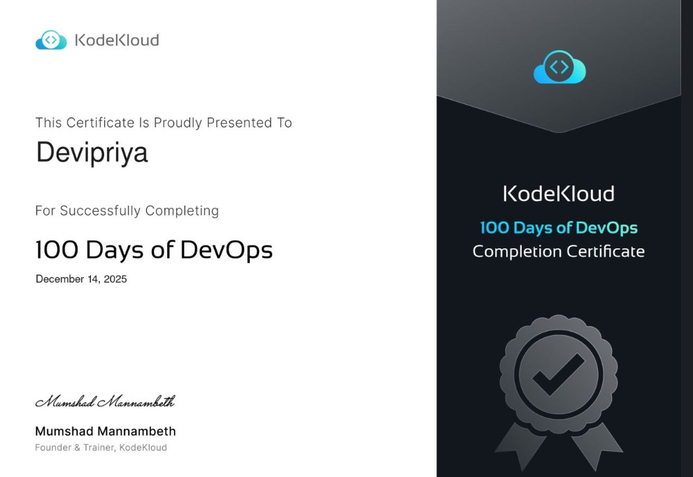

## Quick Start

1. **Star this repository** ⭐ to keep track of your progress
2. **Fork the repo** to create your own copy
3. Start with [Day 001](./days/001.md) - Linux User Setup
4. Follow the daily challenges in order
5. Share your progress using `#100DaysOfDevOps`

> **Want to start the official challenge?** Use this [KodeKloud link](https://linkly.link/2CeSH) - it helps support this project!

## Challenge Progress

## Challenge Completed

**Successfully completed the 100 Days of DevOps Challenge!**

### Daily Challenges

|Day|Challenge|Topics|Solution|
|---|---------|------|--------|
| 001 | Linux User Setup with Non-interactive Shell | Linux, Kubernetes | [Solution](./days/001.md) |
| 002 | Temporary User Setup with Expiry Date | Linux | [Solution](./days/002.md) |
| 003 | Secure SSH Root Access | Linux, Kubernetes | [Solution](./days/003.md) |
| 004 | Script Execute Permissions | Linux, Git | [Solution](./days/004.md) |
| 005 | Install and Configuration Selinux | Linux, Security | [Solution](./days/005.md) |
| 006 | Setup a Cron Job | Linux, Kubernetes | [Solution](./days/006.md) |
| 007 | Linux SSH Automation | Linux, Ansible | [Solution](./days/007.md) |
| 008 | Setup Ansible | Linux, Ansible | [Solution](./days/008.md) |
| 009 | Debugging MariaDB Issues | Linux, Database | [Solution](./days/009.md) |
| 010 | Create a BASH Script | Linux, Networking | [Solution](./days/010.md) |
| 011 | Install and Setup Tomcat Server | Linux, Networking | [Solution](./days/011.md) |
| 012 | Linux Network Services | Linux, Networking | [Solution](./days/012.md) |
| 013 | IPtables Installation And Configuration | Linux, Networking | [Solution](./days/013.md) |
| 014 | Linux Process Troubleshooting | Linux, Networking | [Solution](./days/014.md) |
| 015 | Setup SSL for NGINX | Linux, Nginx | [Solution](./days/015.md) |
| 016 | Install and Configure NGINX as Load Balancer | Linux, Networking | [Solution](./days/016.md) |
| 017 | Install and Configure PostgreSQL | Linux, Database | [Solution](./days/017.md) |
| 018 | Configure LAMP Server (LAMP Stack) | Linux, Database | [Solution](./days/018.md) |
| 019 | Install and Configure Web Application | Linux, Networking | [Solution](./days/019.md) |
| 020 | Configure Nginx + PHP-FPM Using Unix Sock | Linux, Nginx | [Solution](./days/020.md) |
| 021 | Setup Git Repository on Server | Git | [Solution](./days/021.md) |
| 022 | Clone Git Repository | Git, Linux | [Solution](./days/022.md) |
| 023 | Fork a repository | Git, Linux | [Solution](./days/023.md) |
| 024 | Git Branch Create | Git | [Solution](./days/024.md) |
| 025 | Git Branch Merge | Git, Linux | [Solution](./days/025.md) |
| 026 | Git Manage Remotes | Git | [Solution](./days/026.md) |
| 027 | Git Revert Some Changes | Git, Networking | [Solution](./days/027.md) |
| 028 | Git Cherry Pick | Git | [Solution](./days/028.md) |
| 029 | Git Pull Request | Git, Linux | [Solution](./days/029.md) |
| 030 | Git Reset Hard | Git, Linux | [Solution](./days/030.md) |
| 031 | Git Stash | Git, Linux | [Solution](./days/031.md) |
| 032 | Git Rebase | Git | [Solution](./days/032.md) |
| 033 | Git Merge Conflict Resolve | Git, Linux | [Solution](./days/033.md) |
| 034 | Configure Git Hook | Git, Linux | [Solution](./days/034.md) |
| 035 | Setup Docker Installation | Linux, Docker | [Solution](./days/035.md) |
| 036 | Run a NGINX Container on Docker | Docker, Kubernetes | [Solution](./days/036.md) |
| 037 | Copy File to Docker Container | Docker, Kubernetes | [Solution](./days/037.md) |
| 038 | Docker Pull Images | Docker | [Solution](./days/038.md) |
| 039 | Create a Docker Image From a Container | Docker, Git | [Solution](./days/039.md) |
| 040 | Docker Execution | Linux, Docker | [Solution](./days/040.md) |
| 041 | Create a Docker File | Docker, Networking | [Solution](./days/041.md) |
| 042 | Create Docker Network | Docker, Networking | [Solution](./days/042.md) |
| 043 | Docker Ports Mapping | Docker, Kubernetes | [Solution](./days/043.md) |
| 044 | Creating a Docker Compose File | Docker, Networking | [Solution](./days/044.md) |
| 045 | Resolve Dockerfile Issues | Docker, Networking | [Solution](./days/045.md) |
| 046 | Deploy an App on Docker Containers | Docker, Kubernetes | [Solution](./days/046.md) |
| 047 | Docker Python App | Docker, Networking | [Solution](./days/047.md) |
| 048 | Deploy Pods in Kubernetes Cluster | Kubernetes, Docker | [Solution](./days/048.md) |
| 049 | Deploy Applications with Kubernetes Deployments | Kubernetes, Docker | [Solution](./days/049.md) |
| 050 | Set Resource Limits in Kubernetes Cluster | Kubernetes, Docker | [Solution](./days/050.md) |
| 051 | Execute Rolling Updates in Kubernetes | Kubernetes, Docker | [Solution](./days/051.md) |
| 052 | Execute Rollback in Kubernetes Cluster | Kubernetes, Docker | [Solution](./days/052.md) |
| 053 | Resolve VolumeMounts Issue in Kubernetes | Kubernetes, Docker | [Solution](./days/053.md) |
| 054 | Kubernetes Shared Volumes | Kubernetes, Docker | [Solution](./days/054.md) |
| 055 | Kubernetes Sidecar Containers | Kubernetes, Docker | [Solution](./days/055.md) |
| 056 | Deploy Nginx Web Server on Kubernetes Cluster | Kubernetes, Docker | [Solution](./days/056.md) |
| 057 | Print Environment Variables | Kubernetes, Linux | [Solution](./days/057.md) |
| 058 | Deploy Grafana on Kubernetes Cluster | Kubernetes, Docker | [Solution](./days/058.md) |
| 059 | Troubleshoot Deployment Issues in Kubernetes | Kubernetes, Networking | [Solution](./days/059.md) |
| 060 | Persistent Volumes in Kubernetes | Kubernetes, Docker | [Solution](./days/060.md) |
| 061 | Init Containers in Kubernetes | Kubernetes, Docker | [Solution](./days/061.md) |
| 062 | Manage Secrets in Kubernetes | Kubernetes, Docker | [Solution](./days/062.md) |
| 063 | Deploy Iron Gallery App on Kubernetes | Kubernetes, Database | [Solution](./days/063.md) |
| 064 | Fix Python App Deployed on Kubernetes Cluster | Kubernetes, Docker | [Solution](./days/064.md) |
| 065 | Deploy Redis Deployment on Kubernetes | Kubernetes, Docker | [Solution](./days/065.md) |
| 066 | Deploy MySQL on Kubernetes | Kubernetes, Docker | [Solution](./days/066.md) |
| 067 | Deploy Guest Book App on Kubernetes | Kubernetes, Docker | [Solution](./days/067.md) |
| 068 | Set Up Jenkins Server | Linux, Ci/Cd | [Solution](./days/068.md) |
| 069 | Install Jenkins Plugins | Ci/Cd | [Solution](./days/069.md) |
| 070 | Configure Jenkins User Access | Linux, Ci/Cd | [Solution](./days/070.md) |
| 071 | Configure Jenkins Job for Package Installation | Ci/Cd | [Solution](./days/071.md) |
| 072 | Jenkins Parameterized Builds | Ci/Cd | [Solution](./days/072.md) |
| 073 | Jenkins Scheduled Jobs | Ci/Cd | [Solution](./days/073.md) |
| 074 | Jenkins Database Backup Job | Database, Ci/Cd | [Solution](./days/074.md) |
| 075 | Jenkins Slave Nodes | Ci/Cd | [Solution](./days/075.md) |
| 076 | Jenkins Project Security | Ci/Cd, Security | [Solution](./days/076.md) |
| 077 | Jenkins Deploy Pipeline | Kubernetes, Ci/Cd | [Solution](./days/077.md) |
| 078 | Jenkins Conditional Pipeline | Ci/Cd | [Solution](./days/078.md) |
| 079 | Jenkins Deployment Job | Kubernetes, Ci/Cd | [Solution](./days/079.md) |
| 080 | Jenkins Chained Builds | Ci/Cd | [Solution](./days/080.md) |
| 081 | Jenkins Multistage Pipeline | Ci/Cd | [Solution](./days/081.md) |
| 082 | Create Ansible Inventory for App Server Testing | Linux, Ansible | [Solution](./days/082.md) |
| 083 | Troubleshoot and Create Ansible Playbook | Ansible | [Solution](./days/083.md) |
| 084 | Copy Data to App Servers using Ansible | Linux, Ansible | [Solution](./days/084.md) |
| 085 | Create Files on App Servers using Ansible | Linux, Ansible | [Solution](./days/085.md) |
| 086 | Ansible Ping Module Usage | Ansible | [Solution](./days/086.md) |
| 087 | Ansible Install Package | Ansible | [Solution](./days/087.md) |
| 088 | Ansible Blockinfile Module | Ansible | [Solution](./days/088.md) |
| 089 | Ansible Manage Services | Kubernetes, Ansible | [Solution](./days/089.md) |
| 090 | Managing ACLs Using Ansible | Ansible | [Solution](./days/090.md) |
| 091 | Ansible Lineinfile Module | Ansible | [Solution](./days/091.md) |
| 092 | Managing Jinja2 Templates Using Ansible | Ansible | [Solution](./days/092.md) |
| 093 | Using Ansible Conditions | Ansible | [Solution](./days/093.md) |
| 094 | Create VPC Using Terraform | Iac | [Solution](./days/094.md) |
| 095 | Create Security Group Using Terraform | Iac, Security | [Solution](./days/095.md) |
| 096 | Create EC2 Instance Using Terraform | Iac | [Solution](./days/096.md) |
| 097 | Create IAM Policy Using Terraform | Iac | [Solution](./days/097.md) |
| 098 | Launch EC2 in Private VPC Subnet Using Terraform | Iac | [Solution](./days/098.md) |
| 099 | Attach IAM Policy for DynamoDB Access Using Terraform | Iac | [Solution](./days/099.md) |
| 100 | Create and Configure Alarm Using CloudWatch Using Terraform | Iac | [Solution](./days/100.md) |

